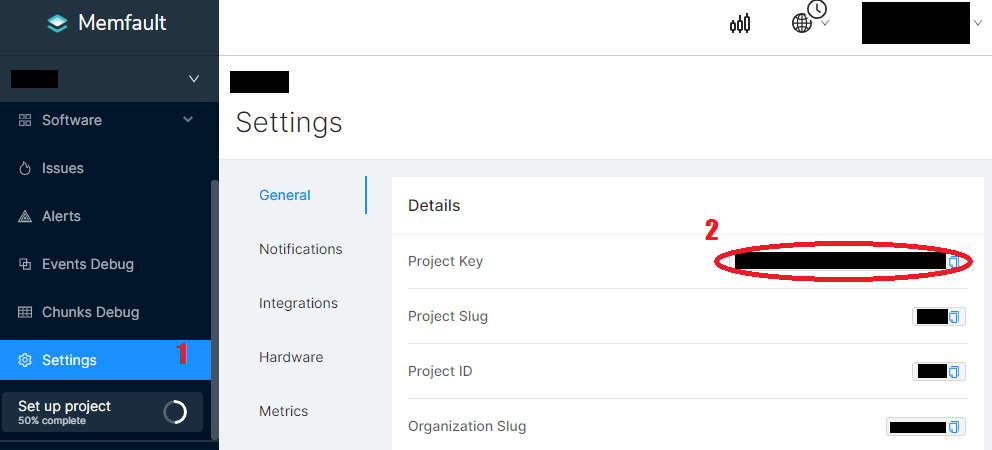
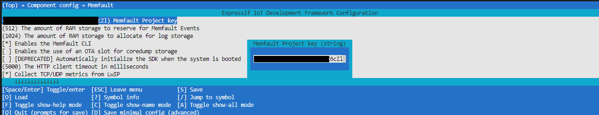
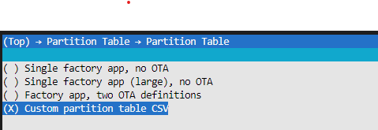
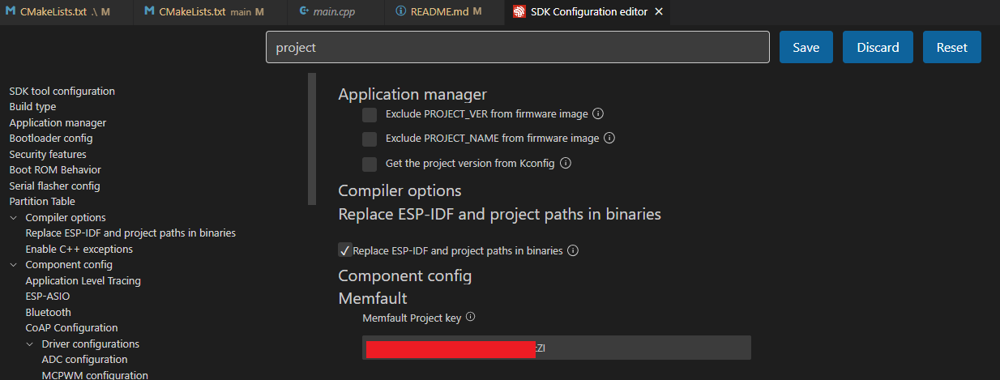
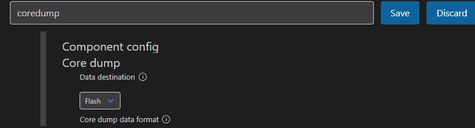
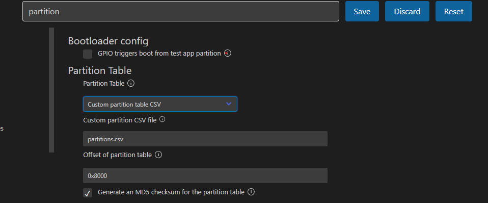

# Memfault Bare Minimum

This project is meant to provide a basic memfault template to use and develop further. This is made by implementing all steps from the guide in the [memfault/espressif-esp32-guide](https://docs.memfault.com/docs/mcu/espressif-esp32-guide/), and taking some snippets from the template [esp32-standalone-example](https://github.com/memfault/esp32-standalone-example), into a fully functioning template with bare minimum steps to follow through, just to get coding quickly. If you would like further indepth and fine grained tuning, it is very well recommended to checkout the two references above and adjust accordingly.

## Getting Started
1. Prepare the environment
    - install VSCode & ESP IDF Extension
    - setup ESP IDF Extension by downloading `v4.4.0`
    - download [memfault-firmware-sdk](https://github.com/memfault/memfault-firmware-sdk) `git clone https://github.com/memfault/memfault-firmware-sdk`, save the folder path for later

2. set the memfault sdk folder location in `CMakeLists.txt`
    - open `CMakeLists.txt` (in root folder, not in `main`), and change the line next to MEMFAULT_FIRMWARE_SDK with the absolute path of your `memfault-firmware-sdk` root folder 
        ```
        ...
        set(MEMFAULT_FIRMWARE_SDK C:/Users/koeip/Documents/Royyan/project-coding/iot/memfault-firmware-sdk) # comment this out if you are not Royyan!
        # set(MEMFAULT_FIRMWARE_SDK path/to/memfault-firmware-sdk) # insert your memfault-firmware-sdk path here!
        ...
        ```

3. get memfault Project Key
    - create memfault account, login into [app.memfault.com](https://app.memfault.com/)
    - navigate through Settings > Project Key
        
        

4. setup sdkconfig and insert Project Key
    - open terminal in root folder `idf.py menuconfig`, or you can do this step by opening the ESP IDF SDK Config Editor in VSCode
        1. navigate through `Component config` > `Memfault` > `Memfault project key` > `<memfault project key>` (insert Memfault Project Key gathered from the Memfault Cloud Dashboard)
        2. navigate through `Component config` > `Core dump` > `Data destination` > choose `Flash`
        3. navigate through `Partition table` > `Partition table` > choose `Custom Partition Table CSV` AND make sure the `Custom partition CSV file` is `partitions.csv` or change accordingly
        4. navigate through `WiFi Credentials Configuration` > fill in `WiFi SSID` AND `WiFi Password`

            <details>
            <summary>Setting through menuconfig</summary>
            <br/>
            
            <br/>
            
            <br/>
            
            </details>

            <details>
            <summary>Setting through SDK config editor</summary>
            <br/>
            
            <br/>
            
            <br/>
            
            </details>            
    - build `idf.py fullclean build`

    <details>
    <summary>Example of output of a successfull build and flash</summary>
    <pre>
    --- Using \\.\COM7 instead...
    --- idf_monitor on \\.\COM7 115200 ---
    --- Quit: Ctrl+] | Menu: Ctrl+T | Help: Ctrl+T followed by Ctrl+H ---
    ets Jun  8 2016 00:22:57

    rst:0x1 (POWERON_RESET),boot:0x13 (SPI_FAST_FLASH_BOOT)
    configsip: 0, SPIWP:0xee
    clk_drv:0x00,q_drv:0x00,d_drv:0x00,cs0_drv:0x00,hd_drv:0x00,wp_drv:0x00
    mode:DIO, clock div:2
    load:0x3fff0030,len:6680
    load:0x40078000,len:14848
    load:0x40080400,len:3792
    0x40080400: _init at ??:?

    entry 0x40080694
    I (27) boot: ESP-IDF v4.4.2-1-gce1fde4b3b-dirty 2nd stage bootloader
    I (27) boot: compile time 13:20:34
    I (27) boot: chip revision: 1
    I (31) boot_comm: chip revision: 1, min. bootloader chip revision: 0
    I (38) boot.esp32: SPI Speed      : 40MHz
    I (43) boot.esp32: SPI Mode       : DIO
    I (47) boot.esp32: SPI Flash Size : 4MB
    I (52) boot: Enabling RNG early entropy source...
    I (57) boot: Partition Table:
    I (61) boot: ## Label            Usage          Type ST Offset   Length
    I (68) boot:  0 nvs              WiFi data        01 02 00009000 00004000
    I (76) boot:  1 otadata          OTA data         01 00 0000d000 00002000
    I (83) boot:  2 phy_init         RF data          01 01 0000f000 00001000
    I (91) boot:  3 factory          factory app      00 00 00010000 00100000
    I (98) boot:  4 storage          Unknown data     01 81 00110000 00084000
    I (106) boot:  5 coredump         Unknown data     01 03 00194000 00057800
    I (113) boot:  6 ota_0            OTA app          00 10 001f0000 00100000
    I (121) boot:  7 ota_1            OTA app          00 11 002f0000 00100000
    I (128) boot: End of partition table
    I (133) boot: Defaulting to factory image
    I (137) boot_comm: chip revision: 1, min. application chip revision: 0
    I (144) esp_image: segment 0: paddr=00010020 vaddr=3f400020 size=17370h ( 95088) map
    I (187) esp_image: segment 1: paddr=00027398 vaddr=3ffb0000 size=02c9ch ( 11420) load
    I (192) esp_image: segment 2: paddr=0002a03c vaddr=40080000 size=05fdch ( 24540) load
    I (203) esp_image: segment 3: paddr=00030020 vaddr=400d0020 size=5602ch (352300) map
    I (331) esp_image: segment 4: paddr=00086054 vaddr=40085fdc size=068cch ( 26828) load
    I (342) esp_image: segment 5: paddr=0008c928 vaddr=50000000 size=00010h (    16) load
    I (349) boot: Loaded app from partition at offset 0x10000
    I (349) boot: Disabling RNG early entropy source...
    I (362) cpu_start: Pro cpu up.
    I (363) cpu_start: Starting app cpu, entry point is 0x4008112c
    0x4008112c: call_start_cpu1 at C:/Users/koeip/esp/esp-idf-v4.4/components/esp_system/port/cpu_start.c:160

    I (0) cpu_start: App cpu up.
    I (377) cpu_start: Pro cpu start user code
    I (377) cpu_start: cpu freq: 160000000
    I (377) cpu_start: Application information:
    I (381) cpu_start: Project name:     memfault-bare-minimum
    I (388) cpu_start: App version:      aa26105-dirty
    I (393) cpu_start: Compile time:     Jul 19 2023 13:19:30
    I (399) cpu_start: ELF file SHA256:  36e463adcea8fbbb...
    I (405) cpu_start: ESP-IDF:          v4.4.2-1-gce1fde4b3b-dirty
    I (412) heap_init: Initializing. RAM available for dynamic allocation:
    I (419) heap_init: At 3FFAE6E0 len 00001920 (6 KiB): DRAM
    I (425) heap_init: At 3FFB55F8 len 0002AA08 (170 KiB): DRAM
    I (431) heap_init: At 3FFE0440 len 00003AE0 (14 KiB): D/IRAM
    I (438) heap_init: At 3FFE4350 len 0001BCB0 (111 KiB): D/IRAM
    I (444) heap_init: At 4008C8A8 len 00013758 (77 KiB): IRAM
    I (451) spi_flash: detected chip: generic
    I (455) spi_flash: flash io: dio
    I (461) mflt: Coredumps will be saved to 'coredump' partition
    I (465) mflt: Using entry 0x3ffb74c8 pointing to address 0x00194000
    I (473) cpu_start: Starting scheduler on PRO CPU.
    I (0) cpu_start: Starting scheduler on APP CPU.
    I (485) mflt: Memfault Build ID: 012d7b166022df97c62d61b13e9b7e8a7babd195
    </pre>
    </details>  

- enjoy!

## To Do
- add wifi
- add pubish data
- add OTA