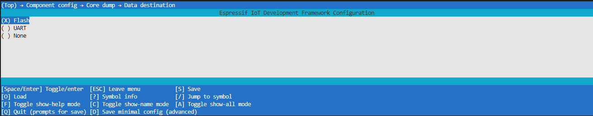

# Memfault Bare Minimum

This project is meant to provide a basic memfault template to use and develop further. This is made by following the guide in the `memfault/espressif-esp32-guide`.

## Getting Started
1. Prepare the environment
    - install VSCode & ESP IDF Extension
    - setup ESP IDF Extension by downloading `v4.4.0`

2. get memfault Project Key
    - create memfault account
    - navigate through Settings > Project Key
        
        

3. set the memfault sdk folder location in `CMakeLists.txt`
    - open `CMakeLists.txt` (in root folder, not in `main`), and change the line next to MEMFAULT_FIRMWARE_SDK with the absolute path of your `memfault-firmware-sdk` root folder 
        ```
        ...
        set(MEMFAULT_FIRMWARE_SDK C:/Users/koeip/Documents/Royyan/project-coding/iot/memfault-firmware-sdk) # comment this out if you are not Royyan!
        # set(MEMFAULT_FIRMWARE_SDK path/to/memfault-firmware-sdk) # insert your memfault-firmware-sdk path here!
        ...
        ```

4. setup sdkconfig and insert Project Key
    - `idf.py fullclean`
    - `idf.py menuconfig`
        - navigate through `Component config` > `Memfault` > `Memfault project key` > `<memfault project key>`
        - insert Memfault Project Key gathered from the 

        - navigate through `Component config` > `Core dump` > `Data destination` > choose `Flash`

            <details>
            <summary>Setting through menuconfig</summary>
            
            <br/>
            
            </details>

            <details>
            <summary>Setting through SDK config editor</summary>
            
            <br/>
            
            </details>            

    - `idf.py build`


- enjoy!